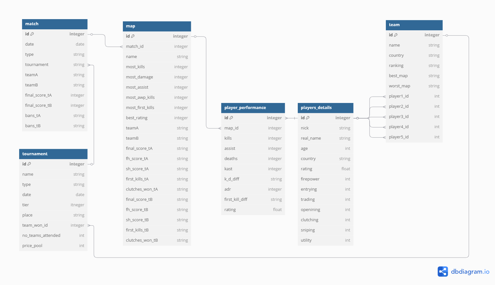

# HLTV-DataScraper

# Background 
In the world of esports, HLTV.org stands as the leading platform for tracking Counter-Strike competitive matches, player statistics, team rankings, and tournament results. With a wealth of structured data, HLTV offers a valuable resource for data enthusiasts looking to explore real-world datasets.

***

# Objectives
* Extract data
* Clean and transform
* Create relationships
* Export for restoration

***

# Tools
* Python pandas
* Python webscrapper
* SQL Server
* TSQL

***

# Relations

  The database includes six tables: map, matches, player_performance, teams, player_details and tournaments. Many-to-one relationships: Since our priority table is a map table, we can pull some details about each map played, such as date, tournament, team bans. Relationships indicate that there can be more than one map for each match. One-to-one relationships refer to the map-player performance relationship, since for each map there is one map with detailed player performance.
  Particulary interesting is relation (one to one) between player performance and player details because it allows you to combine each individual performance with their last 3 month
