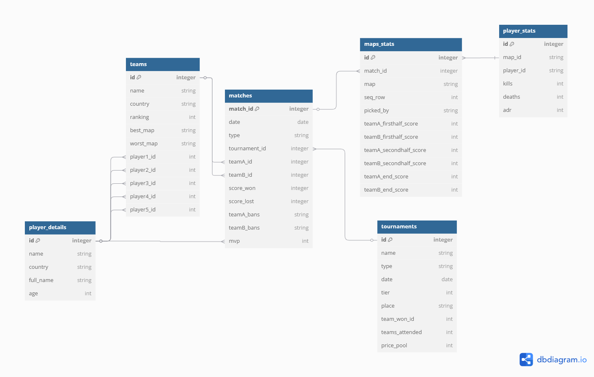

# HLTV-DataScraper

# Background 
In the world of esports, HLTV.org stands as the leading platform for tracking Counter-Strike competitive matches, player statistics, team rankings, and tournament results. With a wealth of structured data, HLTV offers a valuable resource for data enthusiasts looking to explore real-world datasets.

***

# Objectives
* Extract data
* Clean and transform
* Create relationships
* Export for restoration

***

# Tools
* Python pandas
* Python webscrapper
* SQL Server
* TSQL

***

# Relations

The database includes six tables: matches, maps_stats, player_details, player_stats, teams and tournaments. The foreign key relationships are mostly one-to-many, such as one match having many maps stats, and one team having many players. These relationships can be visualized using dbdiagram.io
